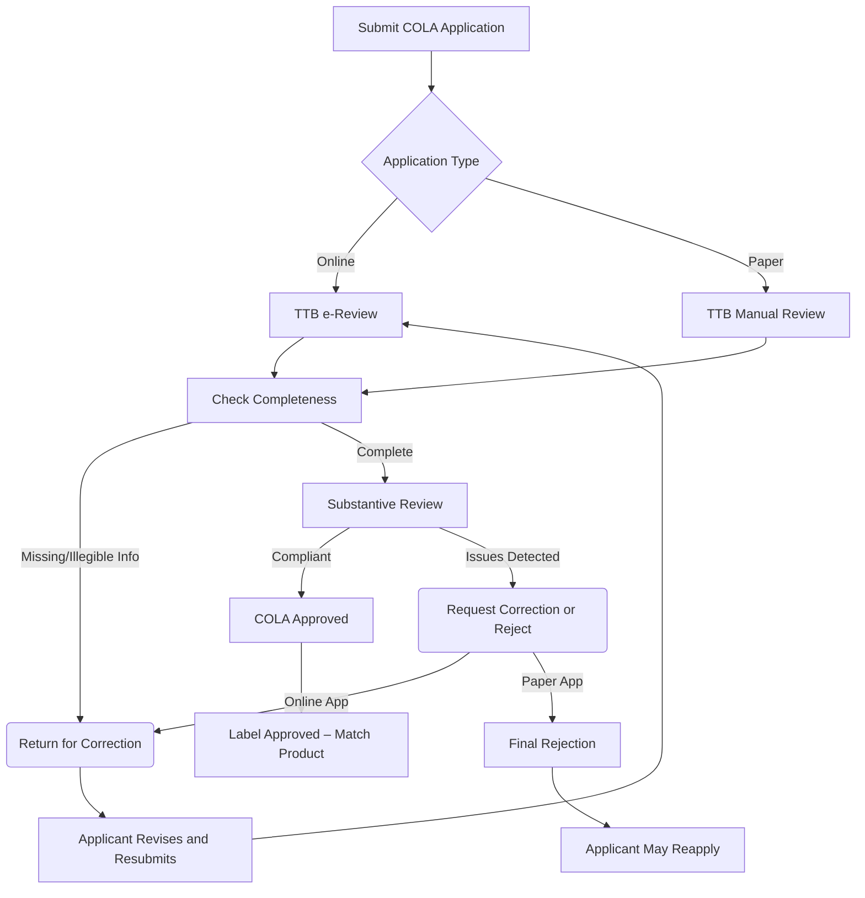

# Executive Summary  
TTB enforces Federal labeling laws (FAA Act §§101–105) and regulations (27 CFR §§4,5,7) requiring all alcohol beverages to bear approved labels (COLAs).  Producers must include *mandatory statements* – e.g. brand name, class/type, alcohol content, net volume, name/address, health warning – and avoid prohibited claims (misleading health benefits, unsubstantiated nutrient boasts, unapproved geographic/“fanciful” implications, etc.).  TTB provides detailed guidance (labeling manuals, FAQs, rulings, industry circulars) on each requirement.  Labels are submitted via Form 5100.31 (COLA) through COLAs Online (electronic) or paper.  TTB reviews for completeness and compliance, issuing approvals (usually within days – median ~1–5 days【18†L182-L190】) or returns for correction.  Key pitfalls include missing/incorrect mandatory items (e.g. net contents), nonconforming claims, or mismatches between approved and final packaging【80†L193-L202】【39†L8-L17】.  TTB offers checklists and interactive tools to avoid errors【98†L195-L203】.  This report analyzes the full framework, labeling rules by product type, allowed wording, COLA process and timing, sample requirements, evidentiary needs, and compliance best practices. 

## Legal and Regulatory Framework  
Labeling rules derive from the **Federal Alcohol Administration (FAA) Act** (27 U.S.C. §§201–214) and TTB regulations (27 CFR Parts 4–5–7).  Section 105(e) of the FAA Act (27 U.S.C. 205(e)) mandates TTB label approvals (COLAs) for wine, spirits, and malt beverages sold interstate【63†L218-L226】.  TTB’s labeling regulations (27 CFR 4 for wine, 5 for spirits, 7 for malt) spell out mandatory label content and prohibited statements.  The TTB COLA program (TTB Form 5100.31) implements these laws【10†L181-L187】【63†L222-L230】.  Industry letters and circulars reiterate that labels must be truthful and not misleading【63†L254-L262】【60†L223-L231】; any curative or therapeutic claims are flatly banned【43†L64-L70】.  TTB also issues “rulings” clarifying special cases (e.g. nutrient claims【39†L8-L17】, gluten claims【86†L13-L21】) and directs enforcement (unauthorized labels can result in refusal of entry or seizure under 27 CFR 5.22, 27.72, 27.91).  

## TTB Guidance & COLA Process  
TTB’s website provides category-specific labeling guides and checklists for beer, wine, and spirits.  For example, the Malt Beverage Labeling page lists required brand name, class/type, net contents, name/address, alcohol content, mandatory additives (sulfites, dyes, etc.), country of origin, and the health warning【73†L193-L202】【73†L210-L214】.  Wine labeling guidance similarly enumerates brand, class/type, % foreign wine, alcohol, color disclosures, country, health warning, name/address, net contents and sulfites【97†L231-L239】【97†L246-L252】.  Distilled spirits guidance lists brand, class/type, alcohol content, **age statement** (if <4 years), color ingredients, commodity statement, health warning, name/address, net contents, and origin【96†L223-L231】【96†L233-L236】.  Checklists summarizing these requirements are provided by TTB【96†L223-L231】【97†L231-L239】.  

All labels must include the mandatory Surgeon General’s health warning (27 CFR 16.21)【73†L210-L214】.  TTB also provides interactive tools (“Anatomy of a Label”) and manuals (the Beverage Alcohol Manuals) to illustrate label elements.  For COLA applications, TTB maintains an online portal (COLAs Online) and accepts Form 5100.31 submissions【10†L181-L187】.  See Table 1 for a comparison of core labeling requirements by product type.

| **Requirement**                | **Beer (Malt Beverage)**              | **Wine**                      | **Distilled Spirits**          |
|-------------------------------|--------------------------------------|-------------------------------|-------------------------------|
| **Brand Name**                | Required (prominent, legible)【73†L193-L200】 | Required【97†L231-L239】         | Required【96†L223-L231】         |
| **Class/Type Designation**    | Required (e.g. “Ale,” “Beer,” etc.)【73†L193-L200】 | Required (e.g. “Wine,” varietal)【97†L231-L239】 | Required (e.g. “Bourbon,” “Vodka,” etc.)【96†L223-L231】 |
| **Net Contents**              | Required (formatted per rules)【73†L193-L200】【80†L193-L202】 | Required【97†L231-L239】         | Required【96†L233-L236】         |
| **Alcohol Content (ABV)**     | Required if any added alcohol (hops extracts)【73†L199-L204】 | Required (on brand label)【97†L231-L239】 | Required (on brand label)【96†L223-L231】 |
| **Health Warning Statement**  | **Required on all labels**【73†L210-L214】 | **Required**【97†L246-L252】       | **Required**【96†L232-L236】       |
| **Name & Address**            | Required (may be on label or container)【73†L193-L200】 | Required【97†L246-L252】         | Required【96†L233-L236】         |
| **Country of Origin**         | Required if imported (with “Product of…” as per CBP)【73†L203-L208】 | Required (imports only)【97†L238-L244】 | Required if imported【96†L233-L236】 |
| **Foreign Content %**         | –                                    | Required if any foreign wine【97†L231-L239】 | –                             |
| **Appellation (AVA, etc.)**   | Not generally used (no AVAs)         | Required when labeling vintage/varietal/“estate”【84†L210-L218】 | Not applicable                |
| **Varietal/Year (“Vintage”)** | – (not used for beer)               | Required ≥75% of that grape (domestic)【84†L274-L282】 | –                             |
| **Sulfite Declaration**       | Required if ≥10 ppm【60†L295-L302】    | Required if ≥10 ppm【60†L295-L302】 | – (spirits exempt)            |
| **Age Statement**             | – (beer has no age designation)      | –                             | Required if less than 4 years old【96†L223-L231】 |

【92†embed_image】 *Figure: Example malt-beverage label showing mandatory elements (brand name “Spring Brew,” ale designation, alcohol proof, net content, etc., and the health warning).  (Image from TTB guidance【73†L193-L202】【73†L210-L214】.)*  

## Allowed vs. Prohibited Label Statements  

**Allowed:** Labels may carry truthful, non-misleading information.  TTB explicitly allows *nutrient statements* (calorie, carbohydrate, etc.) **only if accurate and accompanied by full “statement of average analysis” or “Serving Facts” disclosures**【39†L8-L17】【42†L287-L296】.  “Light” or “lite” can be used (e.g. “Light Beer”) so long as it does not replace the required class/type and is accompanied by average analysis if implying calories【74†L25-L34】.  Specific **comparisons** (e.g. “20 calories less than leading beer”) are permitted when truthful and based on equal volumes【42†L287-L296】.  Gluten-free claims are allowed under FDA’s definition (≤20 ppm) and TTB will permit “gluten-free” on spirits fermented from grains if manufacturing practices ensure it【86†L13-L21】.  Other claims like “no GMO,” “natural,” or “vegan” are generally unrestricted at TTB but must be truthful and not imply a health benefit.  Use of *fanciful/distinctive names* (e.g. “Sandy Beaches” in [70]) is permitted if it does not mislead about origin or contents; if no standard class fits, a fanciful name must be supplemented by a statement of composition【70†L246-L254】.

**Prohibited or Restricted:** Any **false, misleading or unqualified claims** are disallowed.  In particular, TTB forbids health or therapeutic claims – e.g. implying the beverage cures ailments or benefits weight loss – unless fully substantiated and qualified【43†L64-L70】【39†L8-L17】.  Statements that omit required nutritional data (e.g. “low carb” without listing actual carbs, fats, etc.) are misleading and prohibited【39†L8-L17】【42†L287-L296】.  Comparative claims that are unsubstantiated or unfairly disparage a competitor are prohibited.  Brand names or product names may not create a false impression of origin or quality; for example, calling a U.S.-made ale “Belgian Ale” without “Belgian‐style” or “Product of Belgium” would be deceptive【68†L252-L260】.  Geographic indications must meet legal requirements (e.g. AVAs or “Product of” laws)【84†L270-L279】【68†L252-L260】.  Nutrient-content claims (e.g. “low sugar,” “no fat”) are allowed only when they conform to FDA/TTB standards and the average analysis is provided【39†L8-L17】【42†L287-L296】.  TTB prohibits any claim that a beverage imparts a *therapeutic* benefit; all labels must bear the mandated alcohol health warning【43†L64-L70】【73†L210-L214】.  Use of **age statements** on spirits is regulated: age must be stated if *less than* 4 years, and it must be accurate【96†L223-L231】.  Finally, any reference to *organic* or *allergen* status must comply with USDA or FDA rules; TTB defers to AMS for organic certification and to FDA for allergen (e.g. gluten, peanuts) labeling【97†L274-L281】【86†L13-L21】.

## Label Approval Workflow and Timelines  
TTB’s COLA review follows a clear sequence (see flowchart below).  The applicant submits a complete application with a label image (per specs) via COLAs Online or mail【10†L181-L187】.  TTB first checks for required information; missing or illegible items trigger a *“Return for Correction”* on e-apps or outright *rejection* on paper apps【55†L417-L425】.  Corrected submissions are given top priority for review【18†L184-L190】.  If the application is substantively compliant, TTB issues the COLA; if not, it explains deficiencies and (for e-apps) the applicant may resubmit.  In practice, TTB’s service goal is swift: e-app approvals typically occur within 1–3 business days (median 1 day for beer, 3 for spirits, 5 for wine as of 2026)【18†L182-L190】.  Overall, TTB aims to decide 85% of label apps within 15 days【18†L182-L190】.  

Common errors causing delays or denials include missing mandatory elements (e.g. health warning, net content in wrong units), noncompliant claims, or discrepancies between the label and regulatory category (e.g. wrong class/type).  For example, one frequent error is mis-stating net volume in imperial units (TTB guidance provides a conversion table【80†L193-L202】).  Label applications lacking required documentation may also stall; wine with foreign appellations may need proof of origin, and products using FDA-defined terms (like “gluten-free”) should have supporting test data on file.  TTB publishes “Avoiding Common Errors” tips and checklists by product【98†L195-L203】 to help applicants pre-screen labels.  Notably, TTB maintains an *“Allowable Changes”* list on the COLA form【60†L278-L283】: certain non-substantive alterations (e.g. adding a serving suggestion, minor artwork tweaks) can be made without a new COLA.  Any other changes (e.g. new brand name, claims) require re-approval.  

**Mermaid Flowchart: TTB Label Review Process.**  

*Figure: Simplified flow of TTB label (COLA) application review, showing online vs. paper paths, returns for correction, and final approval or rejection.*  

## Matching Approved Label and Packaging  
Once approved, the **actual product label must *exactly* match** the COLA.  Under 27 CFR 7.41–7.44, altering labels on containers without authorization is unlawful【52†L955-L964】.  In other words, every required statement (brand, type, alcohol, etc.) on the COLA must appear identically on the package.  Deviations are permitted only if listed as allowable changes on the COLA form (e.g. adding a “best served chilled” note)【60†L278-L283】.  Manufacturers should therefore use the COLA-approved artwork for printing.  TTB auditors verify compliance in the field; non-matching labels can result in enforcement action (seizure or forfeiture).  

## Label Image & Sample Requirements  
TTB requires a label “specimen” image with the COLA. For electronic applications, the label image must be high-quality – typically **120–170 DPI** with file size under ~1.5 MB【57†L603-L610】.  JPEG or PNG are both accepted; TTB recommends PNG if small text is present【57†L603-L610】.  Dimensions should match actual label proportions.  TTB Form 5100.31 (paper) has instructions for layout and printing.  Physical samples are rarely sent in modern practice, but by regulation TTB may request bottled samples or lab analysis “at any time”【52†L887-L896】. In practice, if an unusual claim or unexplained composition appears, TTB can ask the producer for test results, ingredient specs, or actual product.  For example, waiving a sulfite statement (<10 ppm) requires a TTB-certified lab analysis to document sulfur dioxide content【60†L295-L302】.  

## Documentation and Evidence  
Certain label claims require substantiation.  If labeling a wine “estate bottled,” the winery must **document** that 100% of the grapes and production are from the estate and within the AVA【84†L255-L264】.  Appellation claims (AVA, state, county) trigger minimum-origin rules (e.g. 75% from state, 100% from listed counties【84†L268-L277】) and may require records of grape sourcing.  **Age statements** on spirits must match age records; TTB may demand proof of barrel dates.  USDA organic claims need USDA/AMS certification (TTB allows it only for products with valid USDA organic status).  Any voluntary nutrition or allergen label (e.g. “gluten-free,” “contains sulfites”) should be based on testing data; TTB treats gluten claims under FDA’s §101.91 standards【86†L13-L21】 and allows “gluten-free” only if <20 ppm or properly qualified.  Allergen labeling (sulfites, colorings, aspartame) must follow 27 CFR 7.63 rules【73†L200-L208】.  In general, TTB expects producers to have documentation for any labeled claim: ingredient specs for flavors, certificates for organic, test reports for sulfite and gluten, vineyard contracts for AVAs, etc.  

## TTB Rulings, Circulars, and FAQs (Precedents)  
Several TTB decisions illustrate important labeling principles.  **TTB Ruling 2004–1** clarified that *specific* calorie/carbohydrate statements are allowed (if accompanied by average analysis), but any implication of health benefit (e.g. “low-carb diet”) is considered misleading【39†L8-L17】.  It also affirmed that literal terms like “light” are permitted if accompanied by the required nutritional info【74†L25-L34】.  **Notice 884 (2012)** reaffirmed that *any* unqualified health or therapeutic claim is disallowed【43†L64-L70】.  In 2014–2020, TTB addressed allergen/nutrition claims: Ruling 2014–2 and 2020–2 permit “gluten-free” on distilled spirits meeting FDA’s rule【86†L13-L21】, and allow nutrient facts (Serving Facts, Alcohol Facts, Sugar Content) if properly formatted (see [38]).  Industry Circulars have advised on specific scenarios – e.g. adding Argentina’s “Vino Argentino” logo on labels (allowed as optional info)【63†L254-L262】 and listing expanded allowable changes to skip re-COLA for minor edits【60†L278-L283】.  TTB FAQs and guides (e.g. on wine varietals, beer class, spirits identity) offer case-by-case examples.  For instance, a FAQ explains that “IPA” by itself isn’t sufficient – it must be qualified (e.g. “India Pale Ale”) or treated as a fancy name with composition【68†L242-L249】.  Enforcement actions (public letters) are rare, but violations generally result in demands to correct labeling or pull products; TTB strongly emphasizes that *no sales* may occur until a COLA is on record.  

## Practical Checklist & Best Practices  
1. **Identify Your Product Class:**  Confirm whether the drink is a malt beverage, wine (including cider/mead), or distilled spirit.  This determines which CFR and TTB regs apply, and whether a formula is needed (e.g. all distilled, any flavored spirit, cider ≥7% ABV, etc.).  
2. **Include All Mandatory Elements:**  Use TTB’s checklists【96†L223-L231】【97†L231-L239】.  Ensure brand name, class/type, alcohol by vol, net contents, name/address, and health warning are clearly present.  For wine, also include appellation/vintage/varietal and sulfite statement (if ≥10 ppm)【97†L231-L239】【60†L295-L302】.  For spirits, include age (if <4 years)【96†L223-L231】 and origin.  
3. **Avoid Prohibited Wording:**  Do *not* claim any health benefit or medical effect (e.g. “cures sleeplessness,” “nutritious”)【43†L64-L70】.  Be cautious with comparative or subjective claims; use only if factually supportable【42†L287-L296】.  Do not use “light” or “diet” in an insinuating way without nutritional disclosure【74†L25-L34】.  Don’t list “organic” unless you have valid certification.  Avoid any misleading geographic implication (e.g. “Canadian style whisky” for a non-Canadian whiskey)【68†L252-L260】.  
4. **Format and Legibility:**  Check type size and contrast per 27 CFR standards (e.g. brand must be ≥2 mm on containers >½ pt【70†L201-L209】).  Ensure all text is legible and meets TTB’s figure requirements【70†L201-L209】.  Position statements according to regs (e.g. country of origin on primary label【97†L231-L239】).  
5. **Prepare Label Artwork:**  Save the label image at high resolution (≥120 DPI, <1.5 MB)【57†L603-L610】.  Use the TTB-specified color contrasts and include one of each required panel.  If submitting a paper app, print a color label sample of actual size.  
6. **Attach Documentation:**  Gather proof for claims.  For wine, hold documentation for AVA/vintage percentages.  For “estate bottled,” have deeds/agreements showing winery control of vineyard【84†L255-L264】.  If claiming “gluten-free,” plan to provide gluten test results as per FDA rule【86†L13-L21】.  If exempting sulfites, have a lab report ready【60†L295-L302】.  (TTB may request these.)  
7. **Submit Via COLAs Online:**  Fill out TTB Form 5100.31 online (preferred) and upload the label image.  Double-check that the information in the form (brand, class/type, producer) matches all permit records.  For beer, note class/type on product’s brewing permit.  Click “submit.”  
8. **Monitor and Respond:**  Within hours/days, TTB will either approve or issue a “return for correction” on your e-application.  If returned, address *all* listed issues promptly (you have 30 days by regulation【55†L417-L425】).  For paper submissions, corrections must be refiled in full (paper COLAs often take longer).  Re-submitted corrections jump to the front of the queue【18†L184-L190】.  
9. **Post-Approval Compliance:**  When the COLA is issued, note the number on your label (or records).  Ensure the *actual product label* exactly matches the approved version – even small changes require prior authorization【52†L955-L964】.  File and retain the COLA and any supporting docs as proof of compliance.  
10. **Stay Current:**  Keep up with TTB updates.  For example, labeling rules can change (see TTB newsletters【38†L185-L193】).  If you plan changes in labeling or formulation, consult TTB guidance (Industry Circulars, notices, public rulings) to see if a new COLA is needed or if the change is allowable【60†L278-L283】【63†L254-L262】.

This comprehensive approach – using TTB’s resources and adhering strictly to the regulations – will help ensure timely approval and avoid enforcement problems.  

